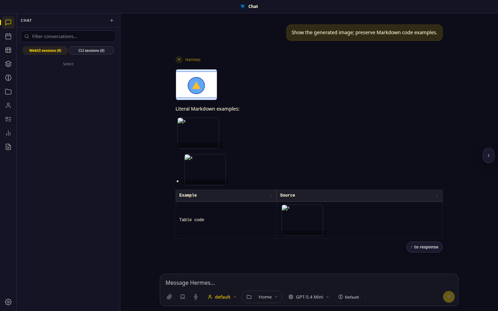
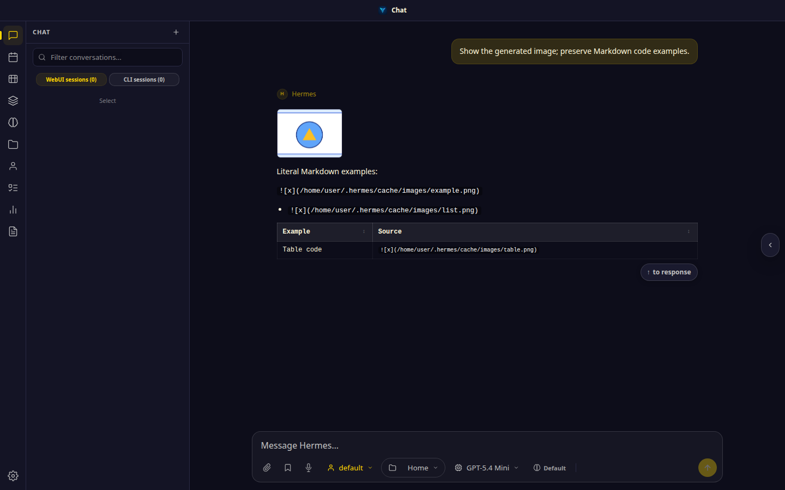
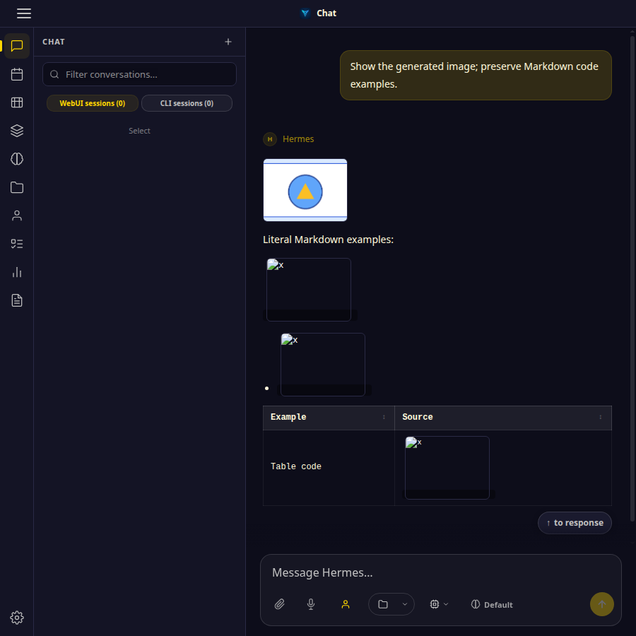
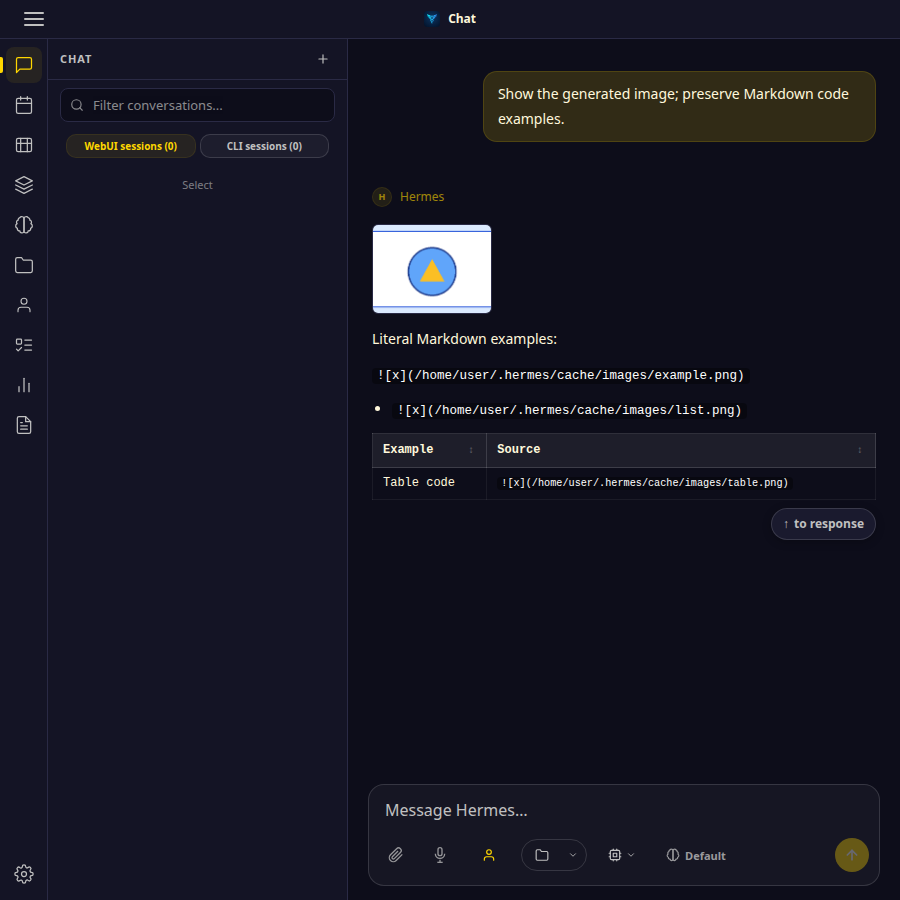
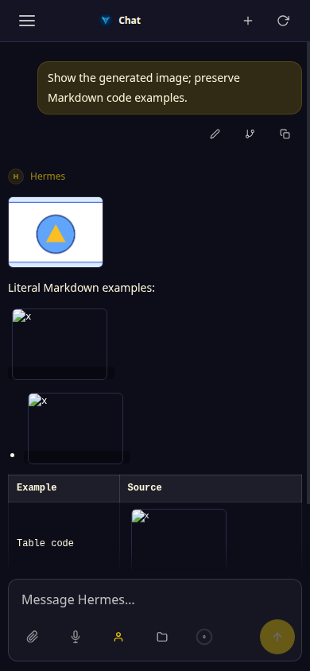
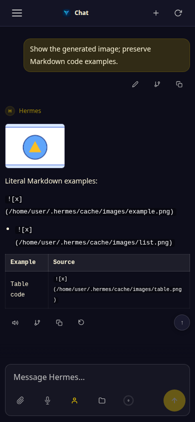

# PR #7635 responsive UI evidence

This evidence addresses the review request for before/after chat-rendering screenshots at desktop, narrow, and mobile widths.

## Capture setup

- Rendered the same two-message transcript in the real Hermes WebUI using its loaded `renderMessages()` function.
- Before: repository parent revision `c89c68142307e440426864879a112ef42684e9f4` (before the inline-code fix).
- After: PR head `e46b109517006853f26f68040ad0b9efa102b029`.
- Browser: headless Google Chrome 154.0.8037.57.
- Viewports: desktop 1440×900, narrow 900×900, mobile 390×844.
- Both previews used isolated temporary Hermes/WebUI state and the same local sample image in a temporary workspace. The sample loaded through the existing session-authorized `/api/media` route; no external image or service was used.
- The shared transcript includes a valid generated-image path plus Markdown image-like text in a plain inline-code span, a list, and a table.

## Observed result

The baseline rendered four image elements: the intended generated image and three unintended images from code spans. At the PR head, only the intended image is rendered; the three examples remain literal code. The prompt and transcript were visible at each viewport, and the image/code counts were checked in the browser DOM in addition to visual inspection.

| Viewport | Before | After |
| --- | --- | --- |
| Desktop, 1440×900 |  |  |
| Narrow, 900×900 |  |  |
| Mobile, 390×844 |  |  |

These screenshots document the renderer correction. They do not represent a general layout or style change; the chat layout is unchanged.
